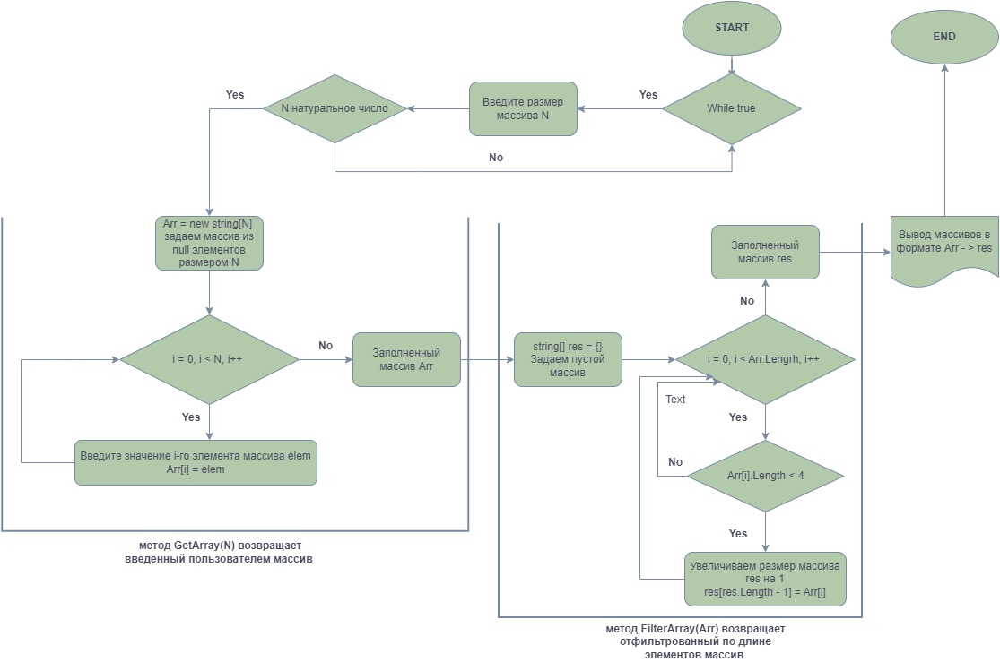

# *Программа для формирования массива из строк, длина которых меньше либо равна 3*

## Реализация выполнена в соответствии с блок-схемой:

1. Предусмотрен ввод размера массива N(натуральное число, int) пользователем с проверкой корректности введенного значения. Программа будет предлагать ввести натуральное число до тех пор, пока не будет введено натуральное число;
2. Далее реализован метод **GetArray(int N)** заполнения массива пользователем, результатом которого является массив **Arr** размером N в качестве элементов содержащий строки;
3. Реализован метод фильтрации введенного пользоввателем массива из строк **FilterArray(string[] Arr)**, который возвращает массив из элементов, длина которых менее либо равна **3**.
4. Вывод результата представлен в следующем виде:

[Массив введенный пользователем] -> [Отфильтрованный массив]

Например:

[sdd, 1221, gg555, yh, :-)] -> [sdd, yh, :-)]